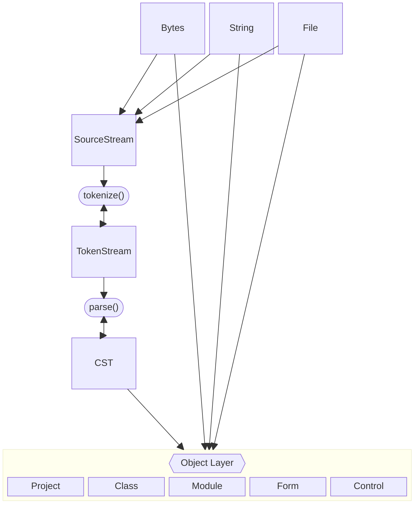

# Goals:

VB6Parse aims to be a complete, end-to-end parser library for VB6. Including, but not limited to:

* (*.vbp) VB6 project files.
* (*.bas) VB6 module files.
* (*.vbw) VB6 windows files for determining IDE editor windows and where they are opened.
* (*.frm) VB6 Form files.
* (*.frx) VB6 Form Resource files.
* (*.dsx) VB6 Data Environment files.
* (*.dsr) VB6 Data Environment Resource files.
* (*.cls) VB6 Class files.
* (*.ctl) VB6 User Control files.
* (*.ctx) VB6 User Control Resource files.
* (*.ttx) Crystal Report files.
* (*.dob) User Document files.

## Architecture



## Current support:

<details>
    <summary> (*.vbp) VB6 Project file parser feature support: </summary>

- [x] Project Types
    - [x] Exe
    - [x] Control
    - [x] OleExe
    - [x] OleDll
- [x] References
- [x] Objects
- [x] Modules
- [x] Designers
- [x] Classes
- [x] Forms
- [x] UserControls
- [x] UserDocuments
- [x] ResFile32
- [x] IconForm 
- [x] Startup 
- [x] HelpFile 
- [x] Title 
- [x] ExeName32 
- [x] Command32 
- [x] Name
- [x] HelpContextID 
- [x] CompatibleMode 
- [x] NoControlUpgrade 
- [x] MajorVer 
- [x] MinorVer
- [x] RevisionVer 
- [x] AutoIncrementVer 
- [x] ServerSupportFiles
- [x] VersionCompanyName
- [x] VersionFileDescription
- [x] VersionLegalCopyright
- [x] VersionLegalTrademarks
- [x] VersionProductName
- [x] CondComp
- [x] CompilationType
- [x] OptimizationType
- [x] NoAliasing
- [x] CodeViewDebugInfo
- [x] FavorPentiumPro(tm) - Yes, this is exactly what this looks like inside the project file, '(tm)' and all.
- [x] BoundsCheck
- [x] OverflowCheck
- [x] FlPointCheck
- [x] FDIVCheck
- [x] UnroundedFP
- [x] StartMode
- [x] Unattended
- [x] Retained
- [x] ThreadPerObject
- [x] MaxNumberOfThreads
- [x] DebugStartOption
- [x] AutoRefresh

</details>

<details>
    <summary> (*.cls) VB6 Class file parser feature support: </summary>

- [x] Header
- [x] VB6 Token stream tokenized.
- [x] VB6 Concrete Syntax Tree formed from Token Stream.
- [ ] VB6 Abstract Syntax Tree formed from the Concrete Syntax Tree.

</details>

<details>
    <summary> (*.bas) VB6 module file parser feature support: </summary>

- [x] Header
- [x] VB6 Token stream tokenized.
- [x] VB6 Concrete Syntax Tree formed from Token Stream.
- [ ] VB6 Abstract Syntax Tree formed from the Concrete Syntax Tree.

</details>

<details>
    <summary> (*.frm) VB6 form file parser feature support: </summary>

- [x] Header
    - [x] Create Forms.
    - [x] Create MDIForms.
    - [x] Create Menu controls.
    - [x] Create Frame controls.
    - [x] Create CheckBox controls.
    - [x] Create ComboBox controls.
    - [x] Create CommandButton controls.
    - [x] Create Data controls.
    - [x] Create DirListBox controls.
    - [x] Create DriveListBox controls.
    - [x] Create FileListBox controls.
    - [x] Create Image controls.
    - [x] Create Label controls.
    - [x] Create Line controls.
    - [x] Create ListBox controls.
    - [x] Create OLE controls.
    - [x] Create OptionButton controls.
    - [x] Create PictureBox controls.
    - [x] Create HScrollBar controls.
    - [x] Create VScrollBar controls.
    - [x] Create Shape controls.
    - [x] Create TextBox controls.
    - [x] Create Timer controls.
    - [x] Create UserControl controls.
    - [/] Support for PropertyGroups (Font for example)
    - [/] Load form property resources from frx files. 

- [x] VB6 Token Stream tokenized.
- [x] VB6 Concrete Syntax Tree formed from Token Stream.
- [x] VB6 Abstract Syntax Tree formed from Concrete Syntax Tree.

 
 **note**: The form currently loads resources from the frx file, but doesn't apply all of them to the correct property locations in all cases yet. 
Instead of creating a picture and assigning it to the Picture property, we only load the binary blob from the FRX file and assign it to the property parsing bag.

Further work is needed to correctly assign the binary resources to the their properties in the standard controls.
</details>

<details>
    <summary> (*.frx) VB6 form resource file parser feature support: </summary>

- [ ] FormResourceFile support.
- [x] Loading of Binary blobs.
- [x] Loading of List items.
- [x] Loading of Strings.

</details>

#### VB6Parse Status:
- [x] Unit Testing - Significantly expanded with 5k+ unit tests.
- [/] Integration/End-to-End Testing - Partially supported. Mostly reading finished.
- [x] Benchmarking.
- [ ] Top level API finalization.
- [/] Documentation - Partially supported. Individual documentation elements finished. Tutorial and Walkthrough still required.


### Examples:

* [cst_parse](examples/cst_parse.rs) - Demonstrates how to parse an array of tokens independent from the rest of the parsing machinery. Useful for consuming a generated token stream which is easier to produce programmatically than VB6 source code.

* [debug_cst](examples/debug_cst) - Demonstrates how to display a useful debug reperesentation of the CST. Helpful for debuging purposes and useful for development of vb6parse and related tools.

* [parse_class](examples/parse_class) - Demonstrates how to consume a possibly erroneous byte array and convert the values into a `SourceFile` then parse the resulting `ClassFile`. In some cases, you need to test valid VB6 *source code* that is also *invalid* Unicode text. An example of this is when loading any VB6 source file that contains the '©' character. English VB6 stores this using Windows-1252 encoding which is an invalid byte sequence in Unicode since the source files are not saved *in* Unicode. Loading from bytes in this way lets you compare the actual byte sequences being loaded with the text conversion results. This will be invaluable for testing and developing the non-english loading future work of the library.

* [parse_module](examples/parse_module.rs) - Demonstrates how to consume text and load it into a `SourceFile` then use the result to parse a module. This, besides loading from a file, is the most likely use case for VB6Parse API consumers.

* [parse_project](examples/parse_project.rs) - Demonstrates how to parse and process a VB6 project file. Language Server Protocol (LSP), Interpreter, Compiler, Code formatter, debugger, editor, etc etc. Almost everything that uses the VB6Parse API will likely start with loading a project before moving on to further analysis and usage.

* [parse_form](examples/parse_form.rs) - Demonstrates how to parse and process a VB6 Form file. Necessary for any GUI editor, localization tool, or UI-check tool.

* [sourcestream](examples/sourcestream.rs) - Demonstrates how to load a `SourceStream` and use it to peek, read, consume, or process a stream of source text. Useful for learning how the tokenizer works or preparing to build one of your own.

* [tokenstream](examples/tokenstream.rs) - Demonstrates how to load a source code stirng into a `SourceStream` and then from there into a `TokenStream` which then can be consumed to produce VB6 `Token`s. Useful for learning the underlying mechanics of VB6Parse or if you need source code converted into tokens without being further converted into a CST or AST.

* [audiostation_parse](examples/audiostation_parse.rs) - Demonstrates a 'real data' parse of the audiostation test data project along with a single module from the project. This is a more complex but more complete example that more closely matches how the VB6Parse API should be used in a real product, error handling, and large scale navigation included.
    


### Tests:

Be sure to use ```git submodule update --init --recursive``` to get all integration test submodule data if you plan to run ```cargo test```.