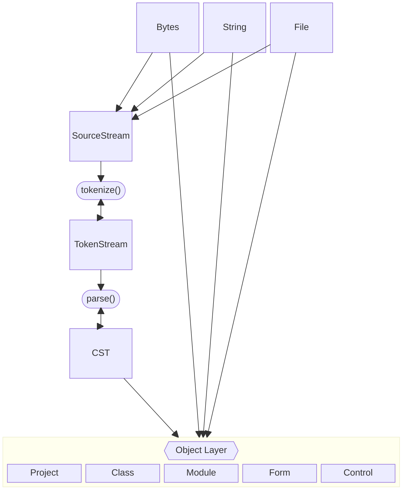

# Goals:

VB6Parse aims to be a complete, end-to-end parser library for VB6. Including, but not limited to:

* (*.vbp) VB6 project files.
* (*.bas) VB6 module files.
* (*.vbw) VB6 windows files for determining IDE editor windows and where they are opened.
* (*.frm) VB6 Form files.
* (*.frx) VB6 Form Resource files.
* (*.dsx) VB6 Data Environment files.
* (*.dsr) VB6 Data Environment Resource files.
* (*.cls) VB6 Class files.
* (*.ctl) VB6 User Control files.
* (*.ctx) VB6 User Control Resource files.
* (*.ttx) Crystal Report files.
* (*.dob) User Document files.

## Architecture



## Current support:

First work has focused on the (vbp) project files since is the method to discover all other files that should be linked/referenced within a project.

<details>
    <summary> (*.vbp) VB6 Project file parser feature support: </summary>

- [x] Project Types
    - [x] Exe
    - [x] Control
    - [x] OleExe
    - [x] OleDll
- [x] References
- [x] Objects
- [x] Modules
- [x] Designers
- [x] Classes
- [x] Forms
- [x] UserControls
- [x] UserDocuments
- [x] ResFile32
- [x] IconForm 
- [x] Startup 
- [x] HelpFile 
- [x] Title 
- [x] ExeName32 
- [x] Command32 
- [x] Name
- [x] HelpContextID 
- [x] CompatibleMode 
- [x] NoControlUpgrade 
- [x] MajorVer 
- [x] MinorVer
- [x] RevisionVer 
- [x] AutoIncrementVer 
- [x] ServerSupportFiles
- [x] VersionCompanyName
- [x] VersionFileDescription
- [x] VersionLegalCopyright
- [x] VersionLegalTrademarks
- [x] VersionProductName
- [x] CondComp
- [x] CompilationType
- [x] OptimizationType
- [x] NoAliasing
- [x] CodeViewDebugInfo
- [x] FavorPentiumPro(tm) - Yes, this is exactly what this looks like inside the project file, '(tm)' and all.
- [x] BoundsCheck
- [x] OverflowCheck
- [x] FlPointCheck
- [x] FDIVCheck
- [x] UnroundedFP
- [x] StartMode
- [x] Unattended
- [x] Retained
- [x] ThreadPerObject
- [x] MaxNumberOfThreads
- [x] DebugStartOption
- [x] AutoRefresh

</details>

<details>
    <summary> (*.cls) VB6 Class file parser feature support: </summary>

- [x] Header
- [x] VB6 Token stream tokenized.
- [ ] VB6 Abstract Syntax Tree formed from Token Stream.

</details>

<details>
    <summary> (*.bas) VB6 module file parser feature support: </summary>

- [x] Header
- [x] VB6 Token stream tokenized.
- [ ] VB6 Abstract Syntax Tree formed from Token Stream.

</details>

<details>
    <summary> (*.frm) VB6 form file parser feature support: </summary>

- [x] Header
    - [x] Create Forms.
    - [x] Create MDIForms.
    - [x] Create Menu controls.
    - [x] Create Frame controls.
    - [x] Create CheckBox controls.
    - [x] Create ComboBox controls.
    - [x] Create CommandButton controls.
    - [x] Create Data controls.
    - [x] Create DirListBox controls.
    - [x] Create DriveListBox controls.
    - [x] Create FileListBox controls.
    - [x] Create Image controls.
    - [x] Create Label controls.
    - [x] Create Line controls.
    - [x] Create ListBox controls.
    - [x] Create OLE controls.
    - [x] Create OptionButton controls.
    - [x] Create PictureBox controls.
    - [x] Create HScrollBar controls.
    - [x] Create VScrollBar controls.
    - [x] Create Shape controls.
    - [x] Create TextBox controls.
    - [x] Create Timer controls.
    - [ ] Create UserControl controls.
    - [x] Load form property resources from frx files. 

- [x] VB6 Token Stream tokenized.
- [ ] VB6 Abstract Syntax Tree formed from Token Stream.

 
 **note**: The form currently loads resources from the frx file, but doesn't apply all of them to the correct property locations in all cases yet. 
Instead of creating a picture and assigning it to the Picture property, we only load the binary blob from the FRX file and assign it to the property parsing bag.

Further work is needed to correctly assign the binary resources to the their properties in the standard controls.
</details>

<details>
    <summary> (*.frx) VB6 form resource file parser feature support: </summary>

- [x] Binary blobs.
- [x] List items.
- [x] Strings.

</details>

#### ProjectFile API:
- [ ] Unit Testing - Partially supported.
- [ ] Integration/End-to-End Testing - Partially supported.
- [x] Benchmarking.
- [ ] Top level API finalization.
- [ ] Documentation - Partially supported.
- [ ] Examples - Partially supported.


### Tests:

Be sure to use ```git submodule update --init --recursive``` to get all integration test submodule data if you plan to run ```cargo test```.